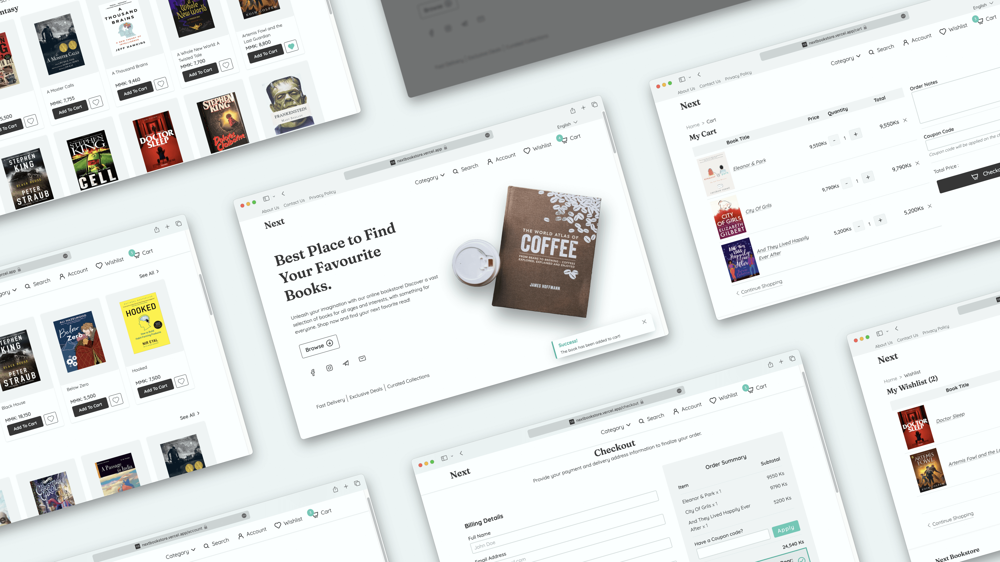

# Next Bookstore (Beta)



An e-commerce project for an online bookstore developed using NextJS 13 and its experimental `appDir`. Frontend UI is crafted with radix-ui and TailwindCSS. To manage server and client state, TanStack Query and Zustand are used respectively. StrapiCMS serves as the backend for this project.

> I designed the entire UI/UX using Figma and created the database design myself. Additionally, I developed this web application from scratch, handling all aspects of the development process.

## Features 🔥

- Responsive Design
- Search Functionality
- Add To Cart
- Add To Wishlist
- SEO-friendly
- Accessible

## Features (Coming Soon 👀) 🚧

The following are the features and functionalities to be added in the future.

- Order Processing
- Filtering Items
- Better Pagination
- Better Error Handling
- Better Loading UI with Next 13
- Accessibility enhancements
- Security improvements
- PWA? 🤷🏻‍♂️
- Testing? 🤷🏻‍♂️

## Technologies Used 👨🏻‍💻

- **NextJS 13 with appDir** - _frontend development_
- **TypeScript** - _type checking_
- **Radix UI** - _accessible components_
- **TailwindCSS** - _styling_
- **Zustand** - _client state_
- **Tanstack-Query & Axios** - _data fetching and server state_
- **React-hook-form** - _form management_
- **Eslint** - _linting_
- **Figma** - _UI/UX_
- **StrapiCMS** - _backend_
- **Vercel & Railway** - _frontend & backend hosting_

## Installation 🔮

To run the project locally, follow these steps:

Clone the repository:

```bash
git clone https://github.com/satnaing/next-bookstore.git
```

Install dependencies for frontend:

```bash
cd next-bookstore && npm install
```

Install dependencies for backend:

```bash
cd backend && npm install
```

Start the frontend: (at the root /)

```bash
npm run dev
```

Start the backend:

```bash
cd backend && npm run develop
```

Open your browser and go to <http://localhost:3000>

## Important Note ⚠️

I have intentionally committed the `backend/.tmp/data.db` file to the GitHub repository. This is because I did not want to set up a separate database for the project and connect it to my free backend hosting. Please note that this approach is not recommended for production-level applications. In a real-world scenario, I would use a more robust DBMS like PostgreSQL, with proper hosting and security configurations.

## Photo Credits 📸

- Hero section image: [Photo by Evgeny Tchebotarev from Pexels](https://www.pexels.com/photo/the-world-atlas-of-coffee-book-2187601/)
- About Page background: [Photo by Min An from Pexels](https://www.pexels.com/photo/pile-of-assorted-novel-books-694740/)
- About Page other image: [Photo by Marta Dzedyshko from Pexels](https://www.pexels.com/photo/assorted-title-books-collection-2067569/)

## Contributing ✨

Contributions are welcome! If you find a bug or want to suggest an improvement, please open an issue or submit a pull request.

## License 📜

This project is licensed under the MIT License. See the [LICENSE](LICENSE) file for details.
